# 🤖 Multi-Agent Vision-Driven Automation Showcase: CUA + Playwright + LangChain
## Unleashing the Power of Computer Use Assistant, Playwright, and Multi-Agent Orchestration
<div align="center">
  
[](https://github.com/shyamsridhar123/MultiAgent-CUA)


[](https://github.com/shyamsridhar123/MultiAgent-CUA)
[](https://github.com/shyamsridhar123/MultiAgent-CUA/fork)
[](https://github.com/shyamsridhar123/MultiAgent-CUA/issues)

</div>

[](https://aka.ms/oai/cuaaccess)
[](https://playwright.dev/)
[](https://python.langchain.com/)
[](https://www.python.org/)
[](LICENSE.md)
[](CHANGELOG.md)

> ⚠️ **Important:** You must apply for access in order to use the Computer Use model. Apply here: https://aka.ms/oai/cuaaccess

## 📚 Table of Contents
- [🏗️ Architecture Overview](#️-architecture-overview)
- [💡 Technology Stack](#-technology-stack-deep-dive)
- [✨ Features](#-features)
- [🚀 Getting Started](#-getting-started)
- [🔧 Usage Options](#-usage-options)
- [📊 Configuration Options](#configuration-options)
- [🧩 Project Components](#-project-components-and-workflow)
- [📈 Demo Examples](#demo-examples)
- [📄 License](#license)

This showcase repository demonstrates the powerful combination of three cutting-edge technologies:

- 👁️ **Computer Use Assistant (CUA)**: An advanced AI model that visually interprets interfaces and executes human-like actions
- 🎭 **Playwright**: A robust browser automation framework providing precise control and cross-browser compatibility
- 🧠 **LangChain Multi-Agent Framework**: A sophisticated orchestration layer enabling complex reasoning and task decomposition

Together, these technologies create an intelligent automation system that can understand, reason about, and interact with digital interfaces through natural language instructions. From simple website navigation to complex multi-step workflows, this framework demonstrates the future of AI-driven computer interaction with built-in safety checks and transparency. ✨

> **Disclaimer:** This repository is provided for **educational purposes only**. The code and techniques demonstrated here are intended for learning about AI-powered computer control and browser automation. They should not be used for any unauthorized access, testing without permission, or any activities that violate terms of service of websites or applications. Users are responsible for ensuring their use of this code complies with all applicable laws, regulations, and terms of service.

## 🏗️ Architecture Overview

This project consists of three main execution options, each offering different levels of sophistication:

1. 💻 **main.py** - Basic implementation for local computer interaction
2. 🌐 **main_playwright.py** - Enhanced implementation using Playwright for browser automation
3. 🧩 **crew_orchestration.py** - Advanced LangChain-based orchestration with multi-agent capabilities

## 💡 Technology Stack Deep Dive

### Playwright Framework

[Playwright](https://playwright.dev/) is a powerful browser automation framework developed by Microsoft that enables reliable end-to-end testing and automation across all modern web browsers. In this project, Playwright is leveraged to:

- **Cross-browser compatibility**: Automate Chrome/Chromium, Firefox, and WebKit with the same API
- **Headless and headed mode**: Run browsers visibly or invisibly based on your needs
- **Reliable automation**: Built-in auto-waiting mechanisms ensure actions execute only when elements are ready
- **Network control**: Intercept network requests, modify responses, and simulate various network conditions
- **Mobile emulation**: Simulate mobile devices with precise viewport, user-agent, and touch support
- **Screenshots and video**: Capture high-quality visual evidence of automation sessions

Our implementation in `playwright_computer.py` enhances the standard Playwright features with:

1. **Resilient navigation**: Circuit breaker pattern to prevent repeated failures when navigating to websites
2. **Human-like interactions**: Randomized timing and patterns to mimic human behavior
3. **Screenshot optimization**: Intelligent screenshot capture with quality settings for performance
4. **User-agent rotation**: Configurable user-agent strings to avoid detection
5. **Error recovery**: Sophisticated error handling and retry mechanisms
6. **Session persistence**: Browser state persistence between runs when needed

Example of creating a Playwright instance with our enhanced configuration:

```python
computer = PlaywrightComputer(
    headless=False,
    browser_type="chromium",
    environment="windows",
    start_url="https://www.bing.com/",
    focus_address_bar=True,
    performance_mode=False,
    reduced_waits=False
)
```

### LangChain Multi-Agent Framework

[LangChain](https://python.langchain.com/) is an open-source framework for building applications with large language models (LLMs). In this project, we leverage LangChain's sophisticated multi-agent architecture to create a robust orchestration layer in `crew_orchestration.py`:

- **Agent-based architecture**: High-level GPT-4.1 agent orchestrates and coordinates with the Computer Use Agent
- **Tool-based framework**: Specialized tools for browser interaction, direct navigation, scrolling, and search
- **ReAct pattern implementation**: Reasoning and acting loop for complex task decomposition
- **System message engineering**: Carefully crafted prompts that optimize agent behavior

Key components of our LangChain implementation:

1. **Agent Executor**: Centralized coordinator that manages the reasoning and action process
   ```python
   self.agent_executor = initialize_agent(
       tools=[browser_tool, navigation_tool, search_tool, scroll_tool],
       llm=llm,
       agent=AgentType.ZERO_SHOT_REACT_DESCRIPTION,
       verbose=True,
       system_message=system_message
   )
   ```

2. **Custom Tool Implementation**: Domain-specific tools for browser interaction
   ```python
   browser_tool = Tool(
       name="browser_interaction",
       func=self.tools.browser_interaction_tool()._run,
       description="Execute a browser interaction like navigation, clicking, or typing."
   )
   ```

3. **Iterative Feedback Loop**: Browser observations are fed back to the orchestration layer
   ```python
   latest_input = (
       "Here is what the browser currently shows:\n"
       f"{observations}\n\n"
       "Please decide the next concrete browser action. "
       "Remember to use the tool-call format."
   )
   ```

4. **Detailed Report Generation**: AI-generated insights based on execution results
   ```python
   report_content = f"""# Task Execution Report
   ## Task Overview
   **Date and Time:** {time.strftime("%Y-%m-%d %H:%M:%S")}
   **Task Description:** {task_description}
   ...
   """
   ```

This multi-agent approach allows for sophisticated reasoning and action sequences that wouldn't be possible with a single model, enabling complex task completion with better reliability and transparency.

### Computer Use Assistant (CUA) Model

The Computer Use Assistant is a specialized AI model from Azure OpenAI that can interpret screenshots and generate appropriate actions to control a computer interface. This model represents a significant advancement in AI-human interaction capabilities:

- **Visual understanding**: Can interpret complex GUI elements, layouts, and visual cues
- **Context awareness**: Maintains understanding of the current state of the application
- **Multi-modal reasoning**: Combines visual information with natural language instructions
- **Adaptive interaction**: Generates appropriate mouse movements, clicks, and keyboard inputs

Key technical aspects of the CUA model:

1. **Input format**: Accepts base64-encoded screenshots along with textual instructions
2. **Output format**: Generates structured action plans in JSON format specifying:
   - Mouse actions (clicks, movements, drags)
   - Keyboard input (text entry, special keys)
   - Scroll operations (direction, distance)
   - Waiting periods for state changes

3. **Screen resolution handling**: Our `Scaler` class in `cua.py` manages resolution differences
   ```python
   computer = cua.Scaler(self.computer, (1024, 768))
   ```

4. **Integration pattern**: The `Agent` class in `cua.py` handles the communication workflow
   ```python
   self.cua_agent = cua.Agent(client, self.computer_use_config.model, scaled_computer)
   ```

5. **Action processing**: Each action from the model is validated, translated to physical operations, and executed with appropriate timing

6. **Safety measures**: Includes built-in guardrails against harmful or destructive actions

#### Capabilities and Limitations

The Computer Use Assistant excels at:
- **Web navigation**: Browsing websites, filling forms, clicking buttons
- **Search operations**: Finding and extracting information from web pages
- **Simple application control**: Basic interactions with desktop applications
- **Reading on-screen text**: Extracting visible textual information

Current limitations include:
- Cannot see or interact with elements that aren't visually present on screen
- Has limited understanding of highly dynamic or animated interfaces
- May struggle with very complex multi-step operations without guidance
- Works best with modern, accessible interface designs

### Playwright Model Context Protocol (MCP)

The Playwright Model Context Protocol (MCP) is a structured protocol for AI models to interact with browser environments through Playwright. While conceptually similar to CUA, the MCP takes a fundamentally different approach to browser automation:

- **DOM-aware interaction**: Operates on structured DOM representation rather than purely visual information
- **Page context understanding**: Has access to the complete document object model and page state
- **Protocol-based communication**: Uses a standardized protocol for browser control and observation
- **Semantic navigation**: Can locate and interact with elements based on their semantic properties

Key technical aspects of the Playwright MCP:

1. **Input format**: Accepts structured context about web pages including DOM trees, accessibility tree, and metadata
2. **Output format**: Generates API-compatible actions for Playwright:
   - Element selectors (CSS, XPath, role-based)
   - Precise interaction commands (click, fill, select)
   - Navigation instructions (goto, back, forward)
   - Evaluation scripts for custom logic

3. **Context generation**: MCP client extracts rich contextual information about the page
   ```python
   context = {
       "url": page.url,
       "title": await page.title(),
       "content": await page.content(),
       "accessibility_tree": await page.accessibility.snapshot(),
       "dom_snapshot": await page.evaluate("() => { /* DOM snapshot code */ }")
   }
   ```

4. **Selective context**: Can request specific parts of the page structure to reduce payload size
   ```python
   element_context = await page.evaluate("""(selector) => {
       const el = document.querySelector(selector);
       return { 
           innerText: el.innerText,
           attributes: Object.fromEntries([...el.attributes].map(a => [a.name, a.value])),
           boundingBox: el.getBoundingClientRect().toJSON()
       };
   }""", "main")
   ```

5. **Execution efficiency**: Direct API calls rather than simulated human interactions
6. **Rich feedback**: Provides detailed success/failure information for each action

## Comparing CUA and Playwright MCP

| Aspect | Computer Use Assistant (CUA) | Playwright Model Context Protocol (MCP) |
|--------|------------------------------|----------------------------------------|
| **Primary Input** | Screenshots (visual) | DOM structure and metadata (semantic) |
| **Interaction Model** | Simulates human actions (mouse, keyboard) | API-level browser automation |
| **Scope** | Any visual interface (desktop/browser) | Browser-only |
| **Visual Understanding** | Complete (can see entire screen) | Limited (requires DOM mapping) |
| **Element Recognition** | Vision-based inference | DOM structure and properties |
| **Failure Recovery** | Requires visual confirmation | Can use DOM assertions and queries |
| **Payload Size** | Large (screenshots) | Variable (can be optimized to specific elements) |
| **Speed** | Moderate (limited by visual processing) | Fast (direct API calls) |
| **Out-of-view Interaction** | Cannot interact with off-screen elements | Can interact with any element in DOM |
| **Dynamic Content** | May struggle with rapid changes | Can attach event listeners for changes |
| **Learning Curve** | Low (natural language instructions) | Moderate (protocol understanding required) |
| **Integration Complexity** | Moderate (screenshot + action pipeline) | Low (Playwright API integration) |

### When to Choose Each Approach

**Choose Computer Use Assistant when:**
- You need to automate both desktop and browser applications
- The interface is highly visual or lacks structured DOM (e.g., canvas-based apps)
- You want to simulate precise human-like interactions
- Your automation needs to adapt to visual changes without code modifications
- Natural language instructions are preferred over programmatic definitions

**Choose Playwright MCP when:**
- You're working exclusively with standard web applications
- Performance and efficiency are critical considerations
- You need to interact with elements that may not be visible on screen
- Your automation needs to handle dynamic content with precise timing
- Deep integration with browser debugging capabilities is required
- You need detailed telemetry about element states and page performance

### Hybrid Approach

This repository demonstrates a hybrid approach that leverages the strengths of both methods:
- Uses CUA for visual understanding and complex decision-making
- Incorporates Playwright for reliable browser control and standardized navigation
- Adds LangChain orchestration for sophisticated multi-step reasoning

By combining these technologies, we achieve a robust automation system that can handle a wide range of tasks with greater reliability than either approach alone.

## ✨ Features

* 🗣️ Natural language computer control through AI models
* 📸 Screenshot capture and analysis
* 🖱️ Mouse and keyboard control
* 🔒 Safety checks and user consent mechanisms
* ☁️ Support for both OpenAI and Azure OpenAI endpoints
* 🖥️ Cross-platform compatibility (Windows, macOS, Linux)
* 📊 Screen resolution scaling for consistent AI model input

## 🚀 Getting Started

### 📋 Prerequisites

* 🐍 Python 3.8 or higher
* 💻 Operating System: Windows, macOS, or Linux
* 🔑 OpenAI API key or Azure OpenAI credentials

### 📦 Installation

1. Clone the repository:
```bash
git clone https://github.com/shyamsridhar123/MultiAgent-CUA.git
cd MultiAgent-CUA
```

2. Install the project using uv (recommended):
```bash
# Install uv if you don't have it
pip install uv

# Install the project with all dependencies
uv pip install -e .

# For development with additional testing tools
uv pip install -e ".[dev]"
```

3. Alternatively, install with pip directly:
```bash
# Install the project with all dependencies
pip install -e .

# For development with additional testing tools
pip install -e ".[dev]"
```

### 📚 Project Structure

This project uses modern Python packaging with `pyproject.toml`:

```
multiagent-cua/
├── pyproject.toml         # Project dependencies and metadata
├── computer-use/          # Main package directory
│   ├── main.py            # Basic local computer control
│   ├── main_playwright.py # Enhanced browser automation
│   └── crew_orchestration.py # LangChain-based orchestration
├── .env.sample           # Environment variable template
└── README.md             # Project documentation
```

#### 🧩 Dependencies

The project's core dependencies are defined in `pyproject.toml`:

- **API Integration**: openai, azure-identity
- **Browser Automation**: playwright
- **Multi-Agent Framework**: langchain, crewai
- **Utilities**: python-dotenv, pydantic, pillow, numpy

## 🔧 Usage Options

### 1️⃣ Basic Usage with Local Computer Control (main.py)

<p align="center">
  
  
  
</p>

The simplest implementation works directly with your local computer:

```powershell
python -m computer-use.main --instructions "Open web browser and go to microsoft.com"
```

#### How it works:
- 📸 Takes screenshots of your screen
- 🧠 Analyzes the visual information
- ⚡ Executes appropriate actions to complete the task
- 🔒 Requests user consent for safety-critical actions (if autoplay disabled)

#### Command Line Arguments for main.py:
* `--instructions`: The task to perform (default: "Open web browser and go to microsoft.com")
* `--model`: The AI model to use (default: "computer-use-preview")
* `--endpoint`: The API endpoint to use ("azure" or "openai", default: "azure")
* `--autoplay`: Automatically execute actions without confirmation (default: true)
* `--environment`: The OS environment (default: "Windows")

### 2️⃣ Browser Automation with Playwright (main_playwright.py)

<p align="center">
  
  
  
</p>

Enhanced implementation using Playwright for more reliable browser automation:

```powershell
python -m computer-use.main_playwright --instructions "Search for the latest Azure AI announcements"
```

#### How it works:
- 🎭 Uses Playwright to create a controlled browser environment
- 🔄 Implements advanced error handling and retry mechanisms
- 🧩 Offers browser-specific features and optimizations
- 👻 Supports headless operation for automated environments

#### Command Line Arguments for main_playwright.py:
* `--instructions`: The task to perform (default: "Open web browser and go to microsoft.com")
* `--headless`: Run browser in headless mode (default: false)
* `--browser`: Browser type to use: "chromium", "firefox", or "webkit" (default: "chromium")
* `--start-url`: Initial URL to navigate to (default: "https://www.bing.com/")
* `--focus-address-bar`: Focus on address bar after startup (default: true)
* `--performance-mode`: Enable high-performance mode with reduced stealth features (default: false)
* `--reduced-waits`: Reduce artificial waiting times between actions (default: false)

### 3️⃣ Advanced Multi-Agent Orchestration (crew_orchestration.py)

<p align="center">
  
  
  
</p>

LangChain-based orchestration with sophisticated multi-agent capabilities:

```powershell
python -m computer-use.crew_orchestration --instructions "Find the current Microsoft stock price and compare it with Google"
```

#### How it works:
- 🧩 Implements a LangChain-based orchestration layer
- 🧠 Uses a higher-level reasoning model (GPT-4.1) to coordinate with the Computer Use model
- 🛠️ Provides specialized tools for common actions (direct navigation, scrolling, search)
- 📊 Generates detailed reports with insights and screenshots
- ⚙️ Features enhanced error handling and circuit breaker patterns

#### Command Line Arguments for crew_orchestration.py:
* `--instructions`: The task to perform (default: "Open a web browser, go to microsoft.com, and check the latest products")
* `--environment`: Environment to simulate: "windows", "mac", "linux", "browser" (default: "windows")
* `--headless`: Run Playwright in headless mode (default: false)
* `--browser`: Browser type for Playwright: "chromium", "firefox", "webkit" (default: "chromium")
* `--start-url`: URL to navigate to at startup (default: "https://www.bing.com/")
* `--focus-address-bar`: Focus on address bar at startup (default: true)
* `--performance-mode`: Enable high-performance mode (default: false)
* `--reduced-waits`: Reduce waiting times between actions (default: false)
* `--close-browser-on-exit`: Close browser when script exits (default: false)

## 🔋 Advanced Usage Scenarios

### 🖥️ VM/Remote Control

<p align="center">
  
</p>

For scenarios requiring remote computer control or VM automation, we recommend using the Playwright-based implementation (`main_playwright.py` or `crew_orchestration.py`). Playwright provides robust browser automation capabilities and is well-suited for VM-based testing and automation scenarios.

For more information on VM automation with Playwright, please refer to:
* 📚 [Playwright Documentation](https://playwright.dev/docs/intro)
* 🛠️ [Playwright VM Setup Guide](https://playwright.dev/docs/ci-intro)

### ☁️ Azure Integration Best Practices

<p align="center">
  
</p>

This project implements several Azure best practices:

1. 🔄 **Resilient Service Integration**
   - Circuit breaker pattern to prevent cascading failures
   - Exponential backoff for retries
   - Proper error handling and logging

2. 🧠 **Azure OpenAI Integration**
   - Structured configuration management
   - API version control
   - Proper timeout and retry settings

3. 📊 **Observability and Monitoring**
   - Comprehensive logging with rotation
   - Performance metrics collection
   - Detailed execution reports

4. 🔒 **Security Considerations**
   - Environment variable-based secrets management
   - Proper error handling to prevent information leakage
   - Documented access controls

## ⚙️ Configuration Options

<p align="center">
  
</p>

The framework offers extensive configuration options across all components. These can be specified through environment variables and command-line arguments.

### 🔐 Environment Variables

#### 🔑 Azure OpenAI Authentication

```powershell
# Computer Use Model API
$env:AZURE_OPENAI_ENDPOINT_COMPUTER_USE="https://your-endpoint.openai.azure.com"
$env:AZURE_OPENAI_KEY_COMPUTER_USE="your-key-here"
$env:AZURE_OPENAI_DEPLOYMENT_COMPUTER_USE="deployment-name"
$env:AZURE_OPENAI_MODEL_COMPUTER_USE="computer-use-preview"

# GPT-4 Turbo API (for crew_orchestration.py)
$env:AZURE_OPENAI_ENDPOINT_GPT41="https://your-endpoint.openai.azure.com"
$env:AZURE_OPENAI_KEY_GPT41="your-key-here"
$env:AZURE_OPENAI_DEPLOYMENT_GPT41="gpt-4-turbo"
$env:AZURE_OPENAI_MODEL_GPT41="gpt-4-turbo"
```

#### API Configuration

```powershell
$env:AZURE_OPENAI_API_VERSION="2024-02-15-preview"  # Global API version
$env:AZURE_OPENAI_API_VERSION_COMPUTER_USE="2025-03-01-preview"  # Model-specific version
```

### 🖥️ Command Line Arguments

<p align="center">
  
</p>

#### 🔄 Shared Arguments (All Implementations)

| Argument | Description | Default |
|----------|-------------|---------|
| `--instructions` | Task instructions to execute | "Open web browser and go to microsoft.com" |
| `--model` | Azure OpenAI model to use | "computer-use-preview" |
| `--endpoint` | API endpoint ("azure" or "openai") | "azure" |
| `--autoplay` | Execute actions without confirmation | `true` |
| `--environment` | Environment to simulate | "windows" |

#### 🎭 main_playwright.py Arguments

<p align="center">
  
</p>

| Argument | Description | Default |
|----------|-------------|---------|
| `--use-playwright` | Use Playwright for browser automation | `false` |
| `--headless` | Run browser in headless mode | `false` |
| `--browser` | Browser type ("chromium", "firefox", "webkit") | "chromium" |
| `--start-url` | Initial URL to navigate to | "https://www.bing.com/" |
| `--focus-address-bar` | Focus on address bar after startup | `true` |
| `--performance-mode` | Enable high-performance mode | `false` |
| `--reduced-waits` | Reduce waiting times between actions | `false` |
| `--timeout` | API call timeout in seconds | 60 |
| `--optimize-screenshots` | Optimize screenshots before sending to API | `true` |
| `--screenshot-timeout` | Maximum time in ms to wait for screenshots | 10000 |
| `--disable-complex-screenshots` | Only take viewport screenshots | `false` |
| `--auto-recovery` | Auto-recover from errors by refreshing pages | `true` |

#### 🧠 crew_orchestration.py Arguments

<p align="center">
  
</p>

| Argument | Description | Default |
|----------|-------------|---------|
| `--use-playwright` | Use Playwright for browser automation | `true` |
| `--headless` | Run browser in headless mode | `false` |
| `--browser` | Browser type ("chromium", "firefox", "webkit") | "chromium" |
| `--start-url` | Initial URL to navigate to | "https://www.bing.com/" |
| `--focus-address-bar` | Focus on address bar after startup | `true` |
| `--performance-mode` | Enable high-performance mode | `false` |
| `--reduced-waits` | Reduce waiting times between actions | `false` |
| `--close-browser-on-exit` | Close browser when script exits | `false` |

### 📝 Configuration Usage Examples

<p align="center">
  
</p>

#### 💻 Basic Local Computer (Highest Compatibility)

```powershell
python -m computer-use.main --instructions "Open Notepad and type Hello World" --environment "windows" --autoplay
```

#### 🚀 Playwright Browser with Performance Optimizations

```powershell
python -m computer-use.main_playwright `
  --instructions "Search for Microsoft news" `
  --use-playwright `
  --browser "chromium" `
  --performance-mode `
  --reduced-waits `
  --optimize-screenshots
```

#### 👻 Headless Browser for Automation Scripts

```powershell
python -m computer-use.main_playwright `
  --instructions "Check if website is working" `
  --use-playwright `
  --headless `
  --auto-recovery `
  --timeout 90
```

#### 🧩 Advanced Multi-Agent Orchestration with Custom Behaviors

```powershell
python -m computer-use.crew_orchestration `
  --instructions "Compare prices for Surface devices" `
  --browser "firefox" `
  --performance-mode `
  --start-url "https://www.microsoft.com" `
  --close-browser-on-exit
```

### 🛠️ Advanced Configuration

<p align="center">
  
</p>

#### 📐 Resolution Scaling

The framework automatically scales screenshots for optimal processing by the AI model. You can adjust this behavior:

```python
# Default scaling for different performance modes
scaled_resolution = (640, 480) if args.optimize_screenshots else (800, 600) if args.performance_mode else (1024, 768)
scaled_computer = cua.Scaler(computer, scaled_resolution)
```

#### 🌐 Browser Configuration

Playwright offers extensive browser configuration options:

```python
# Customize browser launch options
browser = await playwright.chromium.launch(
    headless=headless,
    args=[
        "--disable-dev-shm-usage",
        "--disable-blink-features=AutomationControlled"
    ]
)

# Configure browser context
context = await browser.new_context(
    user_agent=random.choice(user_agents),
    viewport={"width": 1280, "height": 720},
    locale="en-US",
    timezone_id="America/Los_Angeles",
    permissions=["clipboard-read"]
)
```

#### 🧠 Model Parameters

You can adjust model behavior through temperature and timeout settings:

```python
# For deterministic behavior (e.g., exact UI interactions)
client = AsyncAzureOpenAI(
    azure_endpoint=endpoint,
    api_key=api_key,
    api_version=api_version,
    timeout=60.0,  # Increased timeout for larger screenshots
    max_retries=5,  # More retries for reliability
    default_headers={"x-ms-client-application-name": "computer-use-agent"}
)
```

## 🧩 Project Components and Workflow

### 🔑 Key Components

1. 🖥️ **Computer Interface Implementations**
   - `local_computer.py`: Controls the local computer using OS-specific methods
   - `playwright_computer.py`: Controls a browser using the Playwright library
   
2. 🧠 **Model Integration Components**
   - `cua.py`: Core Computer Use Agent integration with scaling capabilities
   - `direct_navigator.py`: Specialized component for direct URL navigation

3. 🔄 **Orchestration Components**
   - `crew_orchestration.py`: LangChain-based orchestration with multi-agent capabilities
   - `crew_browser_tools.py` and `browser_interaction_tool.py`: Specialized browser interaction tools

4. 📊 **Output and Visualization Components**
   - `screenshots/`: Captures of browser state during execution
   - `reports/`: Detailed markdown reports with task execution metrics and insights
   - `logs/`: Debug and activity logs

### 📊 Workflow Diagram

```mermaid
%%{init: {'theme': 'base', 'themeVariables': {'fontSize': '18px', 'fontFamily': 'Arial, sans-serif'}}}%%
flowchart TD
    subgraph "Main Execution Options"
        direction LR
        
        subgraph main.py["💻 main.py"]
            m1["<b>User Input</b>"] -->|Instructions| m2["<b>Local Computer</b><br>Setup"]
            m2 -->|Screenshots| m3["<b>Computer Use</b><br>Assistant API"]
            m3 -->|Actions| m4["<b>Execute on</b><br>Local Computer"]
            m4 -->|Loop| m2
        end
        
        subgraph main_playwright["🌐 main_playwright.py"]
            p1["<b>User Input</b>"] -->|Instructions| p2["<b>Playwright Browser</b><br>Setup"]
            p2 -->|Screenshots| p3["<b>Computer Use</b><br>Assistant API"]
            p3 -->|Actions| p4["<b>Execute via</b><br>Playwright"]
            p4 -->|Loop with Circuit<br>Breaker & Recovery| p2
            p5["<b>Direct</b><br>Navigator"] -.->|Optional Direct<br>URL Navigation| p2
        end
        
        subgraph crew_orchestration["🧠 crew_orchestration.py"]
            c1["<b>User Input</b>"] -->|Task| c2["<b>LangChain</b><br>Orchestrator"]
            c2 -->|High-level<br>Planning| c3["<b>LangChain Tool</b><br>Selection"]
            c3 -->|Browser<br>Interaction| c4["<b>Computer Use</b><br>Assistant API"]
            c4 -->|Actions| c5["<b>Playwright</b><br>Execution"]
            c5 -->|Observations| c2
            c2 -->|Reports| c6["<b>Generate</b><br>Insights"]
        end
    end
    
    m3 -.->|Azure OpenAI| API1["<b>Azure OpenAI</b><br>CUA Model"]
    p3 -.->|Azure OpenAI| API1
    c4 -.->|Azure OpenAI| API1
    c2 -.->|Azure OpenAI| API2["<b>Azure OpenAI</b><br>GPT-4.1"]
    
    classDef api fill:#f0d4ff,stroke:#8A2BE2,stroke-width:3px
    classDef component fill:#d0e4ff,stroke:#0066CC,stroke-width:2px
    classDef execution fill:#c8f0c8,stroke:#006400,stroke-width:3px
    
    class API1,API2 api
    class m1,m2,m3,m4,p1,p2,p3,p4,p5,c1,c2,c3,c4,c5,c6 component
    class main.py,main_playwright.py,crew_orchestration.py execution
```

<p align="center">
  
</p>



#### Architecture Comparison

| Component | main.py | main_playwright.py | crew_orchestration.py |
|-----------|---------|-------------------|----------------------|
| **Input Processing** | Direct task execution | Direct task with retry logic | Task decomposition & reasoning |
| **Interface Control** | Local computer | Playwright browser | Playwright with specialized tools |
| **Error Handling** | Basic | Circuit breaker pattern | Multi-level with recovery |
| **AI Models Used** | CUA only | CUA only | CUA + GPT-4.1 orchestration |
| **Navigation** | Visual only | Visual + Direct Navigator | Visual + LangChain tools |
| **Reporting** | Basic logs | Enhanced logs | Detailed reports with insights |
| **Context Retention** | None | Limited | Full session context |

### 🔄 Interactive Session Example

<p align="center">
  
</p>

When using `crew_orchestration.py`, the system will:

1. 🚀 **Initialize the environment**
   - Set up the browser via Playwright or prepare for local computer control
   - Connect to Azure OpenAI for the CUA model and orchestration model

2. 🧠 **Process the user instruction**
   - The orchestration layer breaks down complex tasks
   - Generates step-by-step browser actions
   - Provides reasoning for each action

3. 👁️ **Execute actions via the CUA model**
   - Takes screenshots
   - Analyzes the visual state
   - Performs precise interactions (clicks, typing, scrolling)
   - Captures observations after each action

4. 📊 **Generate comprehensive reports**
   - Detailed execution history
   - Screenshots at key points
   - Performance metrics
   - AI-generated insights

5. 🔄 **Support interactive follow-ups**
   - After completing the initial task, you can input additional instructions
   - The system maintains context between tasks within the same session

## 🎬 Demo Examples

<p align="center">
  
</p>

<div align="center">
  
  <p><i>Computer Use Assistant navigating and interacting with a website autonomously</i></p>
</div>

### 💻 Basic Local Control Demo

<p align="center">
  
</p>

```powershell
python -m computer-use.main --instructions "Open Notepad and type Hello World"
```

### 🌐 Enhanced Browser Automation Demo

<p align="center">
  
</p>

```powershell
python -m computer-use.main_playwright --instructions "Go to microsoft.com and find information about Azure AI"
```

### 🧠 Advanced Multi-Agent Orchestration Demo

<p align="center">
  
</p>

```powershell
python -m computer-use.crew_orchestration --instructions "Find the current weather in Seattle and compare it with New York"
```

3. Watch as the AI model:
   - Captures and analyzes your screen
   - Performs mouse and keyboard actions
   - Requests consent for safety-critical operations
   - Provides reasoning for its actions

## 📚 Resources

<p align="center">
  
</p>

* 📖 [OpenAI API Documentation](https://platform.openai.com/docs/api-reference)
* ☁️ [Azure OpenAI Documentation](https://learn.microsoft.com/en-us/azure/ai-services/openai/)
* 🖱️ [PyAutoGUI Documentation](https://pyautogui.readthedocs.io/)
* 🎭 [Playwright Documentation](https://playwright.dev/docs/intro)
* 🔗 [LangChain Documentation](https://python.langchain.com/docs/get_started/introduction)

## 📄 License

<p align="center">
  
</p>

This project is licensed under the MIT License - see the [LICENSE.md](LICENSE.md) file for details.

---

<p align="center">
  
  
  
</p>

<p align="center">
  © 2025 Microsoft AI Team. All Rights Reserved.
</p>
